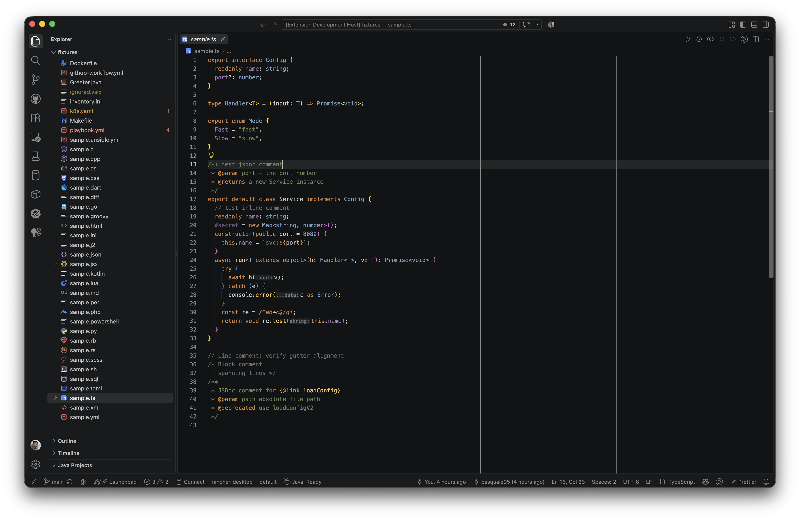
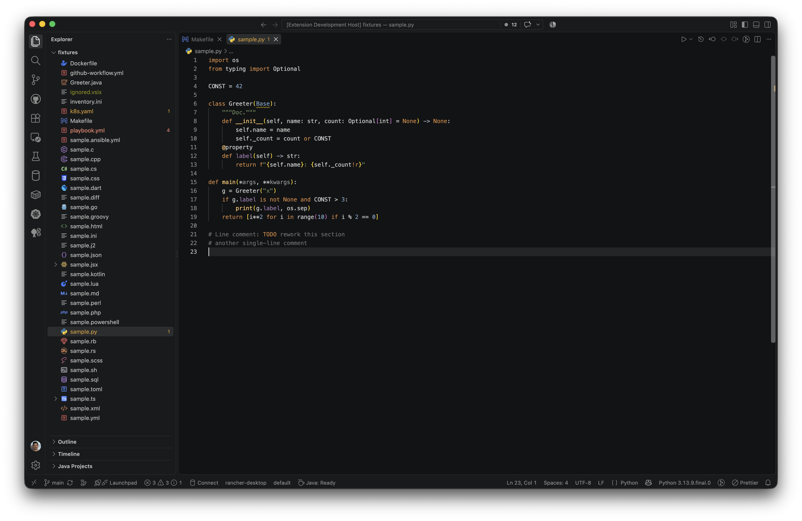
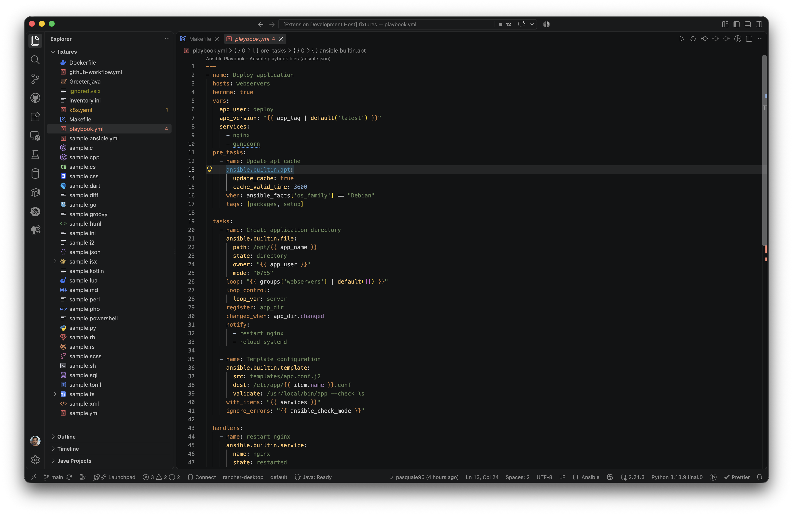
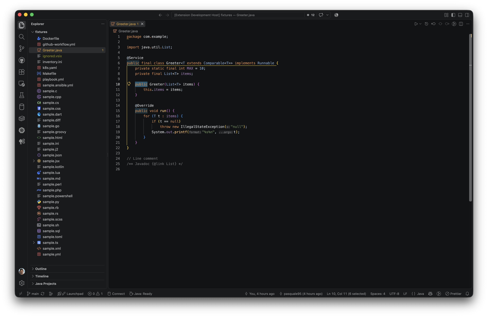
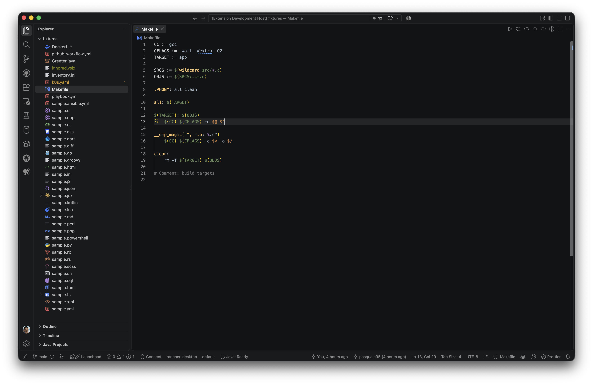

# Holo Dark

<p align="center">
   
   <br />
        
   <br />
</p>

<p align="center">
  <a href="./LICENSE"></a>
  <a href="https://github.com/pasquale95/holo-dark-theme/actions/workflows/publish.yml"></a>
</p>

Visual Studio Code theme combining the **JetBrains Dark** code palette with the **Dark 2026** workbench: Dark 2026's darker, layered backgrounds; JetBrains colors for every code token, git decoration and terminal ANSI color.

Built for comprehensive token coverage — including injected grammars (Jinja inside Ansible YAML) and semantic tokens from language servers — so no code section is left unstyled.

## Preview

<p align="center">
  
</p>
<p align="center">
  
</p>
<p align="center">
  
</p>
<p align="center">
  
</p>
<p align="center">
  
</p>

## Install

Download the latest `.vsix` from the [releases page](https://github.com/pasquale95/holo-dark-theme/releases) and run:

```shell
code --install-extension holo-dark-theme-<version>.vsix
```

Or install from the [VS Code Marketplace](https://marketplace.visualstudio.com/items?itemName=pasquale95.holo-dark-theme) and pick `Holo Dark` from `Preferences -> Color Theme`.

## Palette

| Role                          | Color                                                                                           | Hex                   |
| ----------------------------- | ----------------------------------------------------------------------------------------------- | --------------------- |
| Editor background (Dark 2026) |                                                       | `#121314`             |
| Editor foreground             |                                                       | `#A9B7C6`             |
| Comment                       |                                                     | `#707070`             |
| String                        |                                                       | `#6A8759`             |
| Keyword / storage             |                                                     | `#CC8242`             |
| Number / type                 |                                                           | `#7A9EC2`             |
| Function / tag                |                                                   | `#FFC66D`             |
| Property / constant           |                                                   | `#9E7BB0`             |
| JSON key                      |                                                           | `#9876AA`             |
| Operator / punctuation        |                                                   | `#CCCCCC`             |
| CSS value                     |                                                             | `#A5C261`             |
| Git modified                  |                                                   | `#6897BB`             |
| Git untracked / deleted       |  /  | `#D5756C` / `#6C6C6C` |
| Git ignored                   |                                                     | `#848504`             |

## Build

No build step is required: `themes/holo-dark-color-theme.json` is the source of truth. Package the extension into a `.vsix` with:

```shell
npx @vscode/vsce package
```

## Test

1. Open the repo in VS Code and press **F5** (`Run -> Start Debugging`). This launches an _Extension Development Host_ with the theme loaded, opening `fixtures/` as the workspace.
2. Pick `Holo Dark` from `Preferences -> Color Theme` in that window if it is not the default.
3. Browse the fixture files — they cover every audited language, including both comment styles per language (`//` and `/* */`, `#` and `=begin`, `--` and `--[[ ]]`, ...), Ansible playbooks with Jinja expressions, and diff/Makefile edge cases.
4. To inspect a specific token, run `Developer: Inspect Editor Tokens and Scopes` from the Command Palette (`Cmd+Shift+P`) and hover the token: it shows the scope stack and the resolved color.

## Notes

- `semanticHighlighting` is **on**. A complete semantic-token map keeps LSP tokens in the palette above; Ansible keys stay yellow (`property:ansible`) and playbook keywords orange (`keyword:ansible`).
