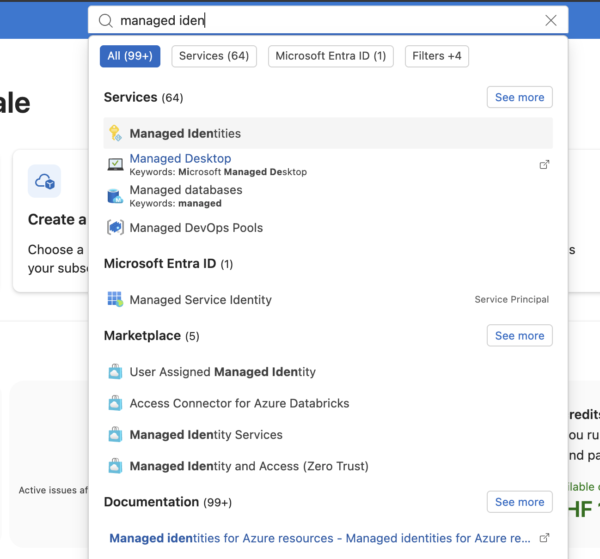
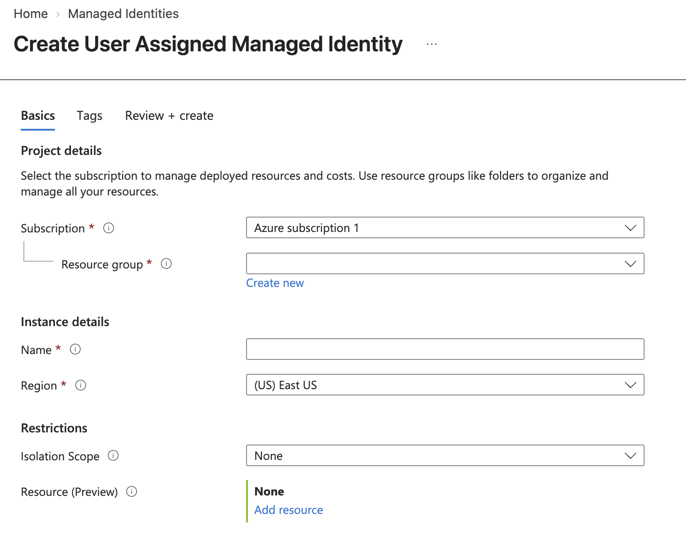
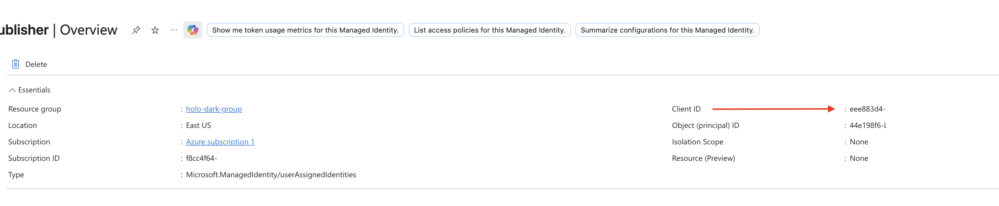
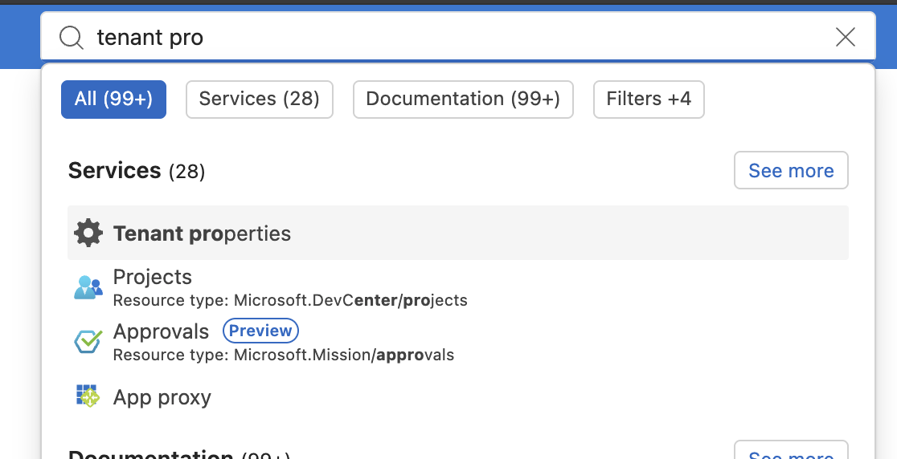
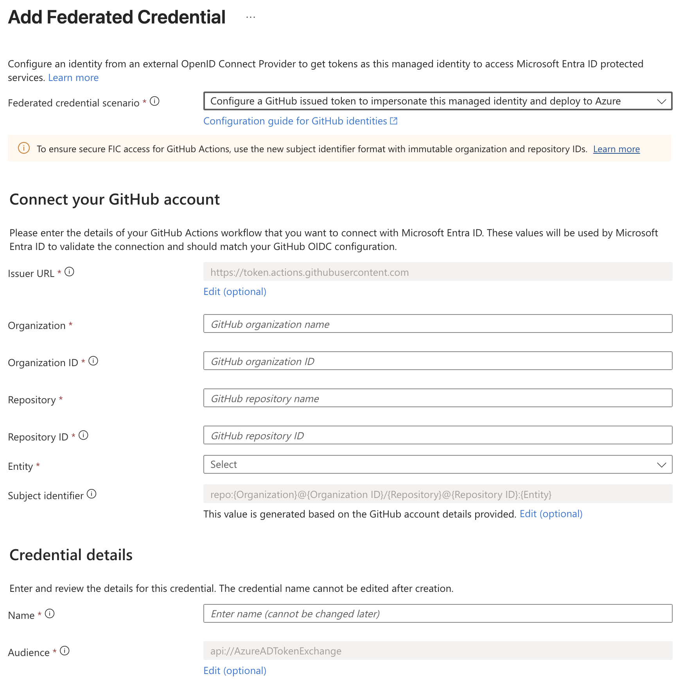
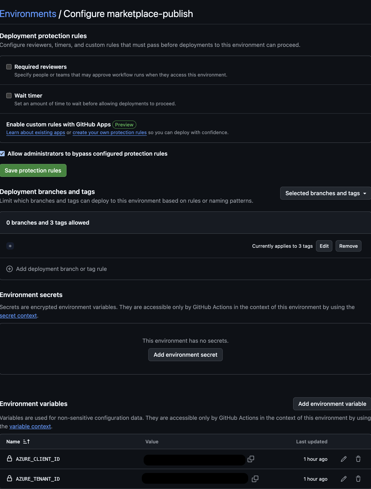
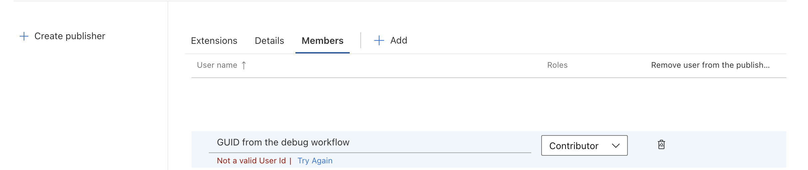
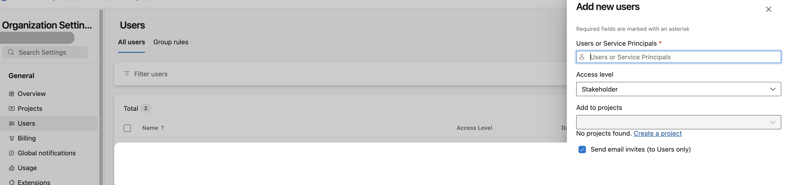

# Publishing to the VS Code Marketplace — Setup & Runbook

This document records the complete Entra ID-based publishing setup for this extension, including every dead end hit along the way, so the next person never has to rediscover them.

Screenshot placeholders are marked `<!-- SCREENSHOT: ... -->` — drop images next to each marker.

## Table of Contents <!-- omit in toc -->

- [Legenda](#legenda)
- [What the pipeline does](#what-the-pipeline-does)
- [One-time setup](#one-time-setup)
  - [0. Prerequisites that had to exist first](#0-prerequisites-that-had-to-exist-first)
  - [1. Managed identity (in the Azure Portal)](#1-managed-identity-in-the-azure-portal)
  - [2. Federated credentials (on the managed identity)](#2-federated-credentials-on-the-managed-identity)
  - [3. GitHub side](#3-github-side)
  - [4. Register the identity with Azure DevOps](#4-register-the-identity-with-azure-devops)
  - [5. Authorize the identity on the publisher](#5-authorize-the-identity-on-the-publisher)
- [How the authentication actually works](#how-the-authentication-actually-works)
- [Release runbook (the only routine part)](#release-runbook-the-only-routine-part)
- [Dead ends hit (so nobody revisits them)](#dead-ends-hit-so-nobody-revisits-them)
- [Maintenance](#maintenance)

## Legenda

All values below are **examples** used consistently throughout the document — the same example always means the same real-world value. When reusing this guide, substitute each example with your own value everywhere it appears.

| Value                                       | Command / source                                                                           | Example value                          |
| ------------------------------------------- | ------------------------------------------------------------------------------------------ | -------------------------------------- |
| Marketplace publisher ID                    | created at <https://marketplace.visualstudio.com/manage>                                   | `my-publisher`                         |
| GitHub user / org name                      | your GitHub account                                                                        | `vscode-publisher`                     |
| GitHub numeric Org ID                       | `curl -s https://api.github.com/users/vscode-publisher \| jq .id`                          | `12345678`                             |
| GitHub repository name                      | the extension's repo                                                                       | `my-vscode-extension-repo`             |
| GitHub numeric Repo ID                      | `curl -s https://api.github.com/repos/vscode-publisher/my-vscode-extension-repo \| jq .id` | `987654321`                            |
| Managed identity name                       | created in Azure Portal (step 1)                                                           | `my-extension-identity`                |
| Managed identity **Client ID**              | managed identity → Settings → Properties → Client ID                                       | `11111111-2222-3333-4444-555555555555` |
| Entra **Tenant ID**                         | Microsoft Entra ID → Overview → Tenant ID                                                  | `aaaaaaaa-bbbb-cccc-dddd-eeeeeeeeeeee` |
| Azure DevOps-internal identity ID           | profile-API registration (step 4), response `.id`                                          | `ffffffff-1111-2222-3333-444444444444` |
| GitHub environment name (created in step 3) | GitHub → Settings → Environments → New environment                                         | `marketplace-publish`                  |

---

## What the pipeline does

Pushing a git tag that matches the `version` in `package.json` (e.g. `1.2.3`) triggers `.github/workflows/publish.yml`, which: verifies the tag equals `package.json`'s version (fails loudly otherwise), packages the extension into `<name>-<version>.vsix`, attaches the VSIX to a GitHub release, and publishes **that exact VSIX** to the VS Code Marketplace, authenticated as a managed identity via Microsoft Entra ID — **no stored secrets anywhere**.

```text
git tag X.Y.Z + push
        │
        ▼
GitHub Actions (publish.yml, tag trigger only)
        │  OIDC token subject:
        │  repo:vscode-publisher@12345678/my-vscode-extension-repo@987654321
        │    :environment:marketplace-publish
        ▼
Microsoft Entra ID (federated credential on managed identity)
        │  short-lived Azure DevOps access token
        ▼
vsce publish --azure-credential --packagePath <vsix>
        │
        ▼
VS Code Marketplace (publisher my-publisher, identity is Contributor member)
```

Why not a Personal Access Token (the old way): global Azure DevOps PATs — the kind Marketplace publishing required — are **retired on 2026-12-01** (creation already capped; all stop working after that date). Entra workload identity federation is the replacement: nothing to rotate, nothing to leak, tokens live for about an hour.

---

## One-time setup

### 0. Prerequisites that had to exist first

**Microsoft account** (any email works — a Gmail address is fine; Outlook/Hotmail is not required).

**Azure free account** via <https://azure.microsoft.com/free> — this bootstraps the **Entra tenant** (the identity directory everything else lives in). Card required for identity verification only, $0.

The **Marketplace publisher** `my-publisher` (<https://marketplace.visualstudio.com/manage>), created with that same Microsoft account.

The `publisher` field in `package.json` must be set (`my-publisher`) — `vsce publish` hard-fails without it, while `vsce package` silently succeeds and stamps the VSIX manifest with `Publisher="undefined"` (nasty trap).

### 1. Managed identity (in the Azure Portal)

Use a **user-assigned managed identity**, NOT an app registration. An app registration authenticates fine but **fails at the actual publish step** with `InvalidAccessException: The requested operation is not allowed`; only a managed identity is accepted by the Marketplace.

Steps: Portal → search **Managed identities** → **+ Create** → any subscription (free tier is enough), a resource group, any name (here `my-extension-identity`), any region, Isolation scope None, no resource/role grants needed.





Copy for later: **Client ID** `11111111-2222-3333-4444-555555555555` (Settings → Properties). The tenant is the one from the free signup; its **Tenant ID** `aaaaaaaa-bbbb-cccc-dddd-eeeeeeeeeeee` is under Microsoft Entra ID → Overview.





### 2. Federated credentials (on the managed identity)

Settings → Federated credentials → **+ Add credential** → scenario **GitHub Actions deploying Azure resources**. The new-style form asks for GitHub's numeric IDs (immutable format — get them from `api.github.com/users/vscode-publisher` and `api.github.com/repos/vscode-publisher/my-vscode-extension-repo`):

| Field                 | Value                                                                                   |
| --------------------- | --------------------------------------------------------------------------------------- |
| Organization / Org ID | `vscode-publisher` / `12345678`                                                         |
| Repository / Repo ID  | `my-vscode-extension-repo` / `987654321`                                                |
| Issuer / Audience     | defaults (`https://token.actions.githubusercontent.com` / `api://AzureADTokenExchange`) |

Two kinds of credentials exist:

**Environment credential — THE ONE THAT MATTERS.** Entity type **Environment**, GitHub environment name **`marketplace-publish`**. Subject produced: `repo:vscode-publisher@12345678/my-vscode-extension-repo@987654321:environment:marketplace-publish`. Version-independent — matches **every** future tag. This is the trick; see "Dead ends" for why the obvious Tag-based options fail.



### 3. GitHub side

**Client/Tenant IDs** — stored as **environment-scoped variables** of `marketplace-publish` (Settings → Environments → marketplace-publish → _Environment variables_), NOT as repo-level variables: this way only jobs deployed to that environment can read them. `AZURE_CLIENT_ID` = `11111111-2222-3333-4444-555555555555`, `AZURE_TENANT_ID` = `aaaaaaaa-bbbb-cccc-dddd-eeeeeeeeeeee`. (Environment variables shadow same-named repo variables, so if they exist in both places the environment wins; keep only the environment copies.)

**Environment** (Settings → Environments): create **`marketplace-publish`** with **no protection rules** — the name must match the federated credential exactly.

**Deployment protection** (same page → _Deployment branches and tags_): rule type **Tag**, pattern **`*`** — only tag refs may deploy to the environment. ⚠️ A pattern like `v*` matches nothing if your tags are bare (`1.2.3`, not `v1.2.3`), and the page's "Currently applies to N tags" counter is the tell.



The publish job declares `environment: marketplace-publish`, which is what puts the environment claim into GitHub's OIDC token.

### 4. Register the identity with Azure DevOps

**The Marketplace recognizes neither the managed identity's Object ID nor its client ID.** Azure DevOps mints its _own_ internal GUID, and it only exists after the identity calls the profile API once. This cost the most time — every `TF14045: The identity could not be found` came from pasting the wrong kind of ID.

One-time fix: commit the following throwaway `workflow_dispatch` workflow (e.g. as `.github/workflows/debug-identity.yml`), push, then run it manually from the repo's **Actions → Debug Identity → Run workflow**. It authenticates as the managed identity and calls the profile API (`499b84ac-1321-427f-aa17-267ca6975798` is Azure DevOps' well-known Entra resource ID, same for everyone):

```yaml
name: Debug Identity
on: workflow_dispatch
permissions:
  id-token: write
  contents: read
jobs:
  debug:
    runs-on: ubuntu-latest
    environment: marketplace-publish
    steps:
      - uses: azure/login@v2
        with:
          client-id: ${{ vars.AZURE_CLIENT_ID }}
          tenant-id: ${{ vars.AZURE_TENANT_ID }}
          allow-no-subscriptions: true
      - name: Register identity with Azure DevOps and print its ID
        run: |
          az rest -u https://app.vssps.visualstudio.com/_apis/profile/profiles/me \
            --resource 499b84ac-1321-427f-aa17-267ca6975798
```

The job log prints a JSON block whose `"id"` field is the identity's Azure DevOps-internal ID (`ffffffff-1111-2222-3333-444444444444` in our example values):

```json
{
  "displayName": "my-extension-identity",
  "id": "ffffffff-1111-2222-3333-444444444444",
  "publicAlias": "ffffffff-1111-2222-3333-444444444444"
}
```

**Delete the workflow file and push again afterwards** — it is a one-shot registration tool, and leaving it would let anyone with write access to the repo mint DevOps identity registrations.

### 5. Authorize the identity on the publisher

<https://marketplace.visualstudio.com/manage> → `my-publisher` → **Members** → **Add** → paste the Azure DevOps ID from step 4 (`ffffffff-1111-2222-3333-444444444444`) → role **Contributor**.



### 5a. The Azure DevOps organization detour (only if Members still refuses)

The Marketplace publisher is backed by an **Azure DevOps organization**, and the Members dialog resolves identities against that org's directory — this is the source of the `TF14045` errors if the org doesn't know your Entra tenant. We went through this detour before finding the profile-API fix (step 4); it is documented here for completeness, to be attempted **only** if Members still refuses after step 4:

1. **Find the publisher's backing org**: open <https://aex.dev.azure.com/me> — it lists every Azure DevOps organization your Microsoft account belongs to. (The org name is often old and unrelated to the publisher name — ours was a leftover gaming handle, and publisher name ≠ org name is normal. The org name is never user-facing.)
2. **Connect the org to your Entra tenant**: `https://dev.azure.com/<org>` → **Organization settings** (bottom-left gear) → **Microsoft Entra** → **Connect tenant** → select your tenant → confirm the user mapping. ⚠️ After connecting, the org disappears from the "Microsoft account" view of your DevOps profile — that is expected, it moved to the tenant's directory view; the org and publisher are unharmed.
3. **Give the managed identity a seat in the org**: Organization settings → **Users** → **Add user** → search the identity's display name (e.g. `my-extension-identity`) → Access level **Stakeholder** → no projects → Add.
4. **Retry step 5** (publisher Members with the `<devops-identity-id>`).



Note: the publisher is permanently bound to the DevOps org that created it — it cannot be moved to a different org, and the org cannot be renamed. Deleting the backing org is risky (publishing may break); deleted orgs have a 28-day soft-delete recovery window via <https://aex.dev.azure.com/me>.

<!-- SCREENSHOT: Organization settings → Microsoft Entra, connected state -->

---

## How the authentication actually works

**What a GitHub environment is.** An environment is a named deployment gate attached to jobs: a job that declares `environment: marketplace-publish` becomes a _deployment_ to that environment, and GitHub (a) stamps its OIDC identity token with an `environment` claim and (b) grants the job access to that environment's own variables, secrets and protection rules. Environments are the natural place to bind "the credentials needed to publish" to "the act of publishing".

**The authentication handshake.** When a tag push starts the workflow, the job runs `azure/login@v2`, which drives this exchange:

```mermaid
sequenceDiagram
    autonumber
    participant W as GitHub Actions job (azure/login)
    participant G as GitHub OIDC provider
    participant E as Microsoft Entra ID
    participant M as Managed identity (my-extension-identity)
    participant V as vsce publish --azure-credential
    participant MP as VS Code Marketplace
    W->>G: request OIDC identity token (id-token: write)
    G-->>W: JWT, ~1h, single-use<br/>subject: repo:&lt;org&gt;@&lt;org-id&gt;/&lt;repo&gt;@&lt;repo-id&gt;:environment:marketplace-publish
    W->>E: exchange JWT for access token
    E->>E: check issuer + audience + full subject<br/>against federated credentials (char-for-char)
    alt subject matches
        E->>M: authenticate as managed identity
        E-->>W: short-lived Azure DevOps access token
    else no match
        E-->>W: AADSTS700213 (this is how tag/branch mismatches bit us)
    end
    W->>V: token available via AzureCliCredential (az cli session)
    V->>MP: publish VSIX, authenticated as the managed identity
    MP-->>V: OK (identity is Contributor member of publisher my-publisher)
```

**Why the two IDs alone are worthless to an attacker.** `AZURE_CLIENT_ID` and `AZURE_TENANT_ID` are not secrets — they are _identifiers_, the equivalent of a username. Knowing them tells you which identity exists, and nothing more. To actually obtain a token for that identity you would need to satisfy the federated credential, and that requires producing a JWT that GitHub signs with the exact subject `repo:vscode-publisher@12345678/my-vscode-extension-repo@987654321:environment:marketplace-publish` — and GitHub only signs such tokens inside Actions, only for workflows in _this_ repository (Organization and Repository IDs are baked into the subject), only for jobs deployed to _that_ environment, and only with `id-token: write` permission. Even a stolen copy of the variables gets an attacker nothing; the trust is anchored in GitHub's signature and the subject match, not in anything copyable. The one caveat to keep it that way: never widen the subject (e.g. `repo:vscode-publisher/*`) and never remove the environment's tag-only deployment rule — the strictness of the subject string is the whole security model.

---

## Release runbook (the only routine part)

```shell
# 1. Bump "version" in package.json (and add a CHANGELOG entry)
# 2. Commit, then:
git tag X.Y.Z
git push origin X.Y.Z
```

---

## Dead ends hit (so nobody revisits them)

| Symptom                                                                             | Cause                                                                  | Fix                                                     |
| ----------------------------------------------------------------------------------- | ---------------------------------------------------------------------- | ------------------------------------------------------- |
| `vsce publish`: `Missing extension "publisher"`                                     | no `publisher` in `package.json`                                       | add it                                                  |
| Portal login: `AADSTS50058`                                                         | stale Azure cookies / silent-SSO failure                               | incognito window, clear `microsoftonline.com` cookies   |
| Portal login: `Selected user account does not exist in tenant 'Microsoft Services'` | personal MSA with no Entra tenant yet                                  | create the Azure free account — that creates the tenant |
| `TF14045: The identity could not be found` in publisher Members                     | pasted Object ID / client ID — Azure DevOps uses its own internal GUID | profile-API registration (step 4), then paste _that_ ID |
| Login: `AADSTS700213: No matching federated identity record` (branch)               | credential subject was `refs/tags/*`, run was on `main`                | Environment credential covers all refs                  |
| Login: `AADSTS700213` (tag)                                                         | wildcard `tags/*` credential never matches; exact-tag did              | switch to Environment credential (permanent fix)        |
| App registration path                                                               | authenticates, but publish rejected with `InvalidAccessException`      | use managed identity                                    |

## Maintenance

Nothing rotates or expires: the federated credential and publisher membership are permanent.

If vsce ships its hidden `--oidc` trusted-publishing flag (present on `main` of microsoft/vscode-vsce, unreleased as of 2026-09), the entire Azure side can be deleted and the workflow reduced to `vsce publish --oidc`. Watch the vsce changelog.

Optional Azure cleanup: the unused app registration and any legacy DevOps orgs can be deleted — the publish path touches neither.
